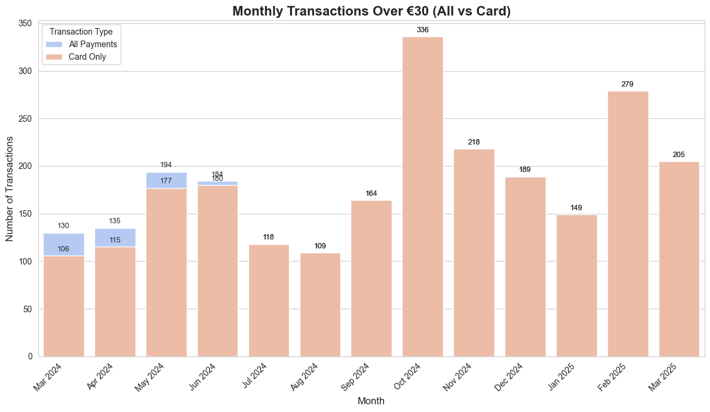
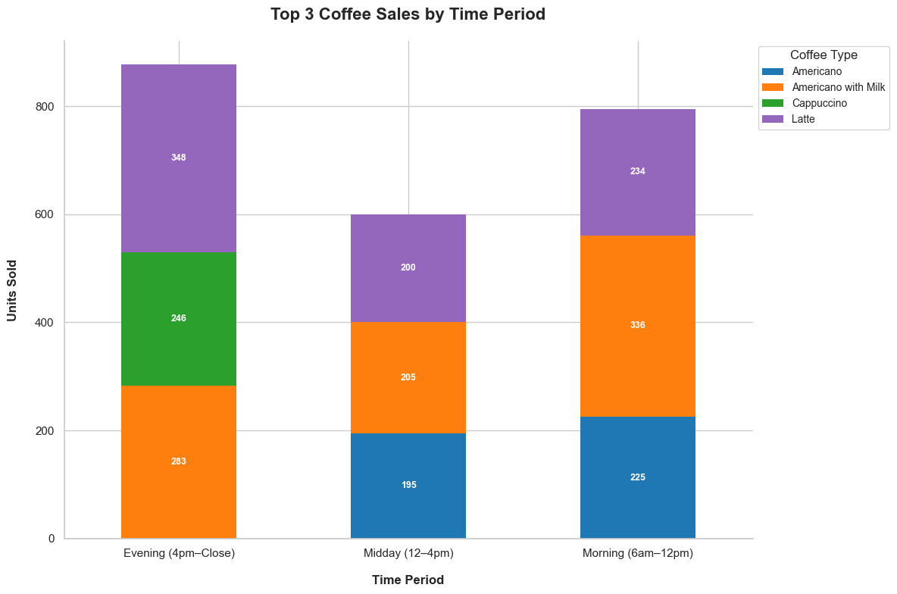
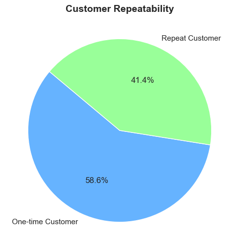
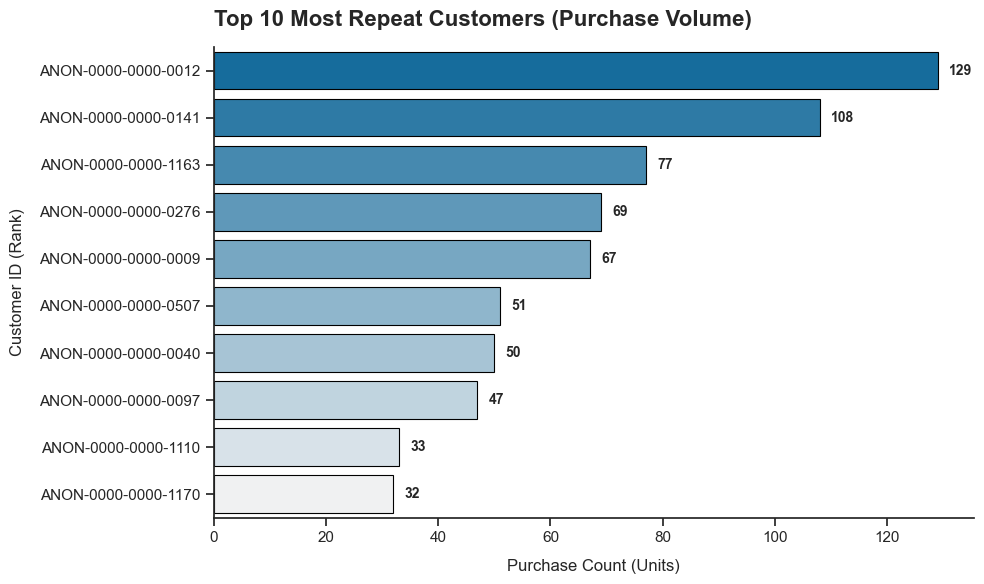
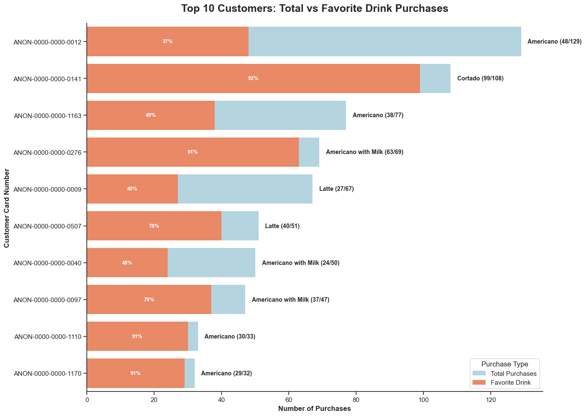
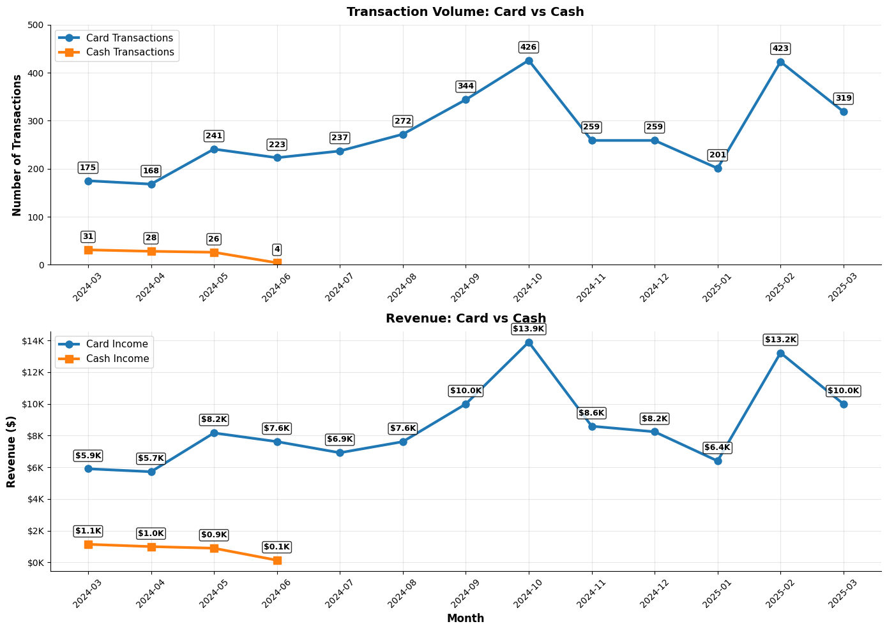
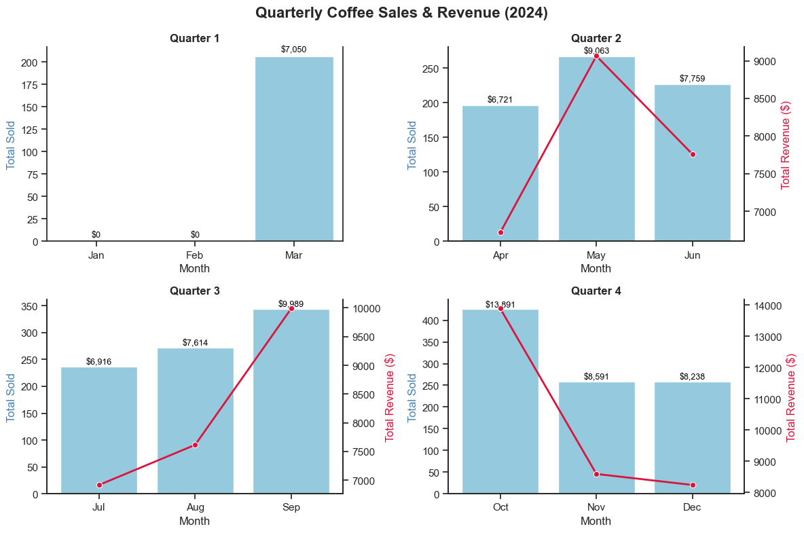
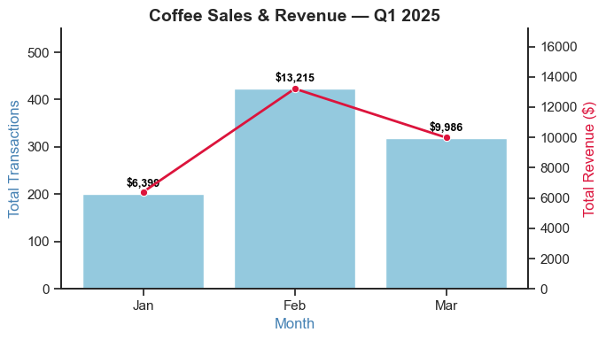
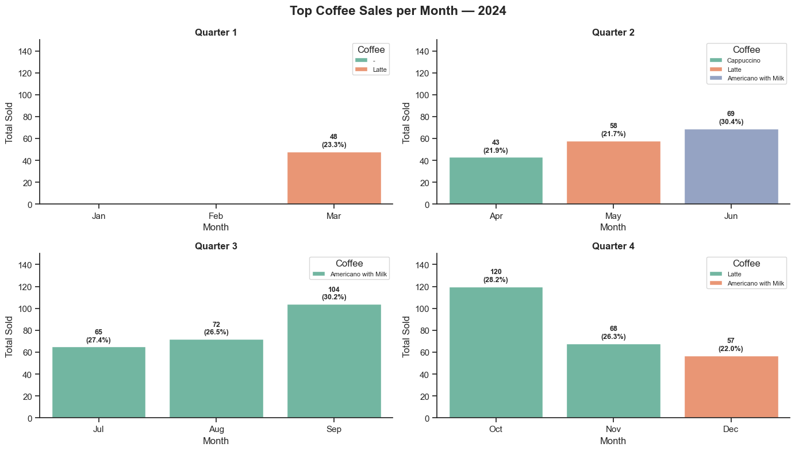
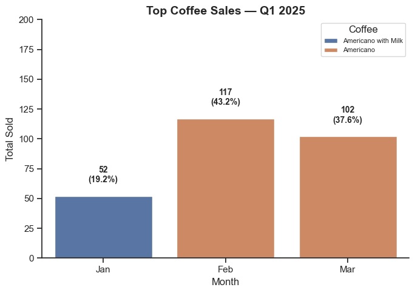

# ☕ Coffee Shop Sales Analysis (March 2024 – March 2025)

## 🪄 Introduction
This project explores one year of coffee shop transaction data to uncover trends in **customer behavior, sales performance, and product popularity**.  
Using SQL for data extraction and Python (Pandas + Seaborn) for visualization, I transformed raw transaction logs into meaningful insights.  

The goal was to gain hands-on experience with **data analysis workflows** from querying databases to visualizing and interpreting results.

---

## 🏪 Background
The dataset was obtained from **Kaggle** and represents transactions from a coffee shop’s point-of-sale system.  
Each transaction includes details such as:
- Purchase timestamp  
- Coffee name  
- Payment type (cash or card)  
- Transaction amount  
- Encrypted customer card number  

The analysis focuses on understanding **sales trends across time, coffee preferences, and customer repeatability**.  

---

## 🧰 Tools Used
| Category | Tools / Libraries |
|-----------|------------------|
| **Database** | PostgreSQL |
| **Code Editor** | VS Code |
| **Language** | SQL, Python |
| **Libraries** | pandas, seaborn, matplotlib, psycopg2, sqlalchemy |
| **Notebook** | Jupyter (`.ipynb`) |

---

## 📈 Analysis & Visualizations
Below are the main analyses and visual insights from the project.  
Click the links to view the full code and interactive notebook.

---

### 🧮 1. Monthly Transactions Exceeding €30  
**Objective:** Find how many times transactions above €30 occurred per month and compare card vs. total payments.

📊 **Insight:**  
Card payments dominate large transactions, particularly during peak months.

🔗 [View Notebook → `monthly_transactions.ipynb`](1_num_of_transaction.ipynb)

**Visualization:**  

---

### ☕ 2. Top Coffee Types Sold  
**Objective:** Identify which coffee types were most popular based on revenue/value and quantity sold.  

📊 **Insight:**  
Latte and Americano with Milk consistently rank as top sellers throughout the year.

🔗 [View Notebook → `top_coffee_sales.ipynb`](2_drinks.ipynb)
**Visualization:**  

---

### 🕒 3. Sales by Time of Day  
**Objective:** Analyze sales trends across Morning, Midday, and Evening periods.  

📊 **Insight:**  
Morning (6 AM–12 PM) sees the highest overall sales volume, while Evening sales show higher average transaction values.

🔗 [View Notebook → `time_period_sales.ipynb`](3_sales_time.ipynb)

**Visualization:**  

---

### 💳 4. Customer Repeatability (Card-Based Analysis)  
**Objective:** 
- Measure customer loyalty by tracking repeated card numbers. 
- Find Top 10 most loyal customers with their number of repetitions along with their favourite drink.

📊 **Insight:**  
Approximately **41% of customers** made multiple purchases using the same card, showing moderate repeat engagement.

🔗 [View Notebook → `customer_repeatability.ipynb`](4_customer_repetition.ipynb)

**Customer Repeatability:**  

**Top 10 Customers:**  

**Top 10 Customers Favourite Drink:**  

---

### 🧾 5. Cash vs Card Transactions (Monthly Analysis)
**Objective:** Compare cash and card transactions over time, both in terms of 
- number of transactions and 
- total revenue per payment type

📊 **Insight:** 
Cash payment was only from the March-June, 2024, and it's in decreasing order. Sales Volume and revenue was continuesly increasing until October, 2024 and decreasing unitl the first month of 2025. This helps understand customer payment preferences and how they evolve month to month.

🔗 [View Notebook → `quarterly_analysis.ipynb`](5_cash_card.ipynb)

**Visualization:**  

---
### 📅 6. Quarterly Sales Overview  
**Objective:** Compare total sales and coffee types per quarter and per month to spot seasonal trends.  

📊 **Insight:**  
Q4, 2024 recorded the highest revenue, driven by winter beverage demand where in October, the sales was the highest of the whole year. On the first quarter of the 2025, highest revenue was collected on February

🔗 [View Notebook → `quarterly_analysis.ipynb`](6_quaterly_reports.ipynb)

**Visualization:**  

---

## 🧠 What I Learned
This project helped me strengthen both **SQL querying** and **Python visualization** skills.  
Key takeaways:
- Efficiently extracting insights using **aggregate SQL functions**  
- Cleaning and transforming real-world data for analysis  
- Using **Seaborn** to create grouped and comparative visualizations  
- Connecting PostgreSQL to Jupyter via **SQLAlchemy**  
- Structuring a data project with clear storytelling for GitHub  

---

## 🧾 Conclusion
Through this analysis, I was able to turn raw transactional data into **actionable insights** about customer preferences and sales behavior.  
This project reinforced the importance of combining **SQL for structured data exploration** and **Python for visual storytelling**.  

It also served as a valuable exercise in building a **portfolio-ready analytics workflow** — from data extraction to visualization and presentation.

---

## 📬 Author
**Rajendra Shrestha**  

